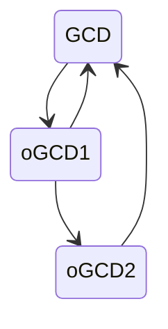
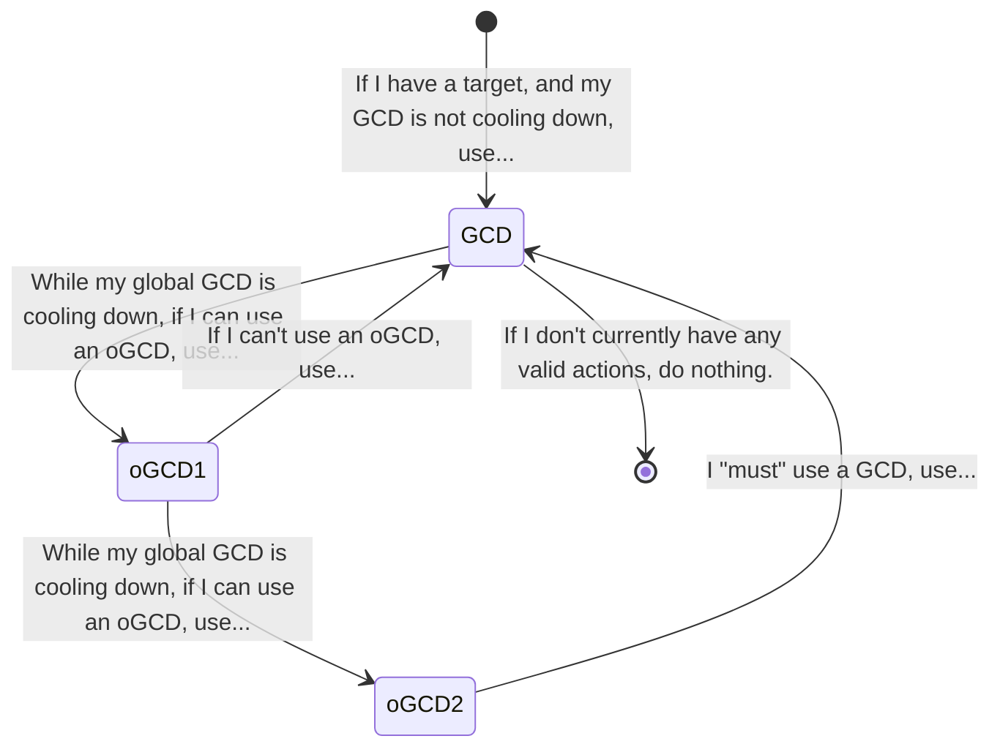
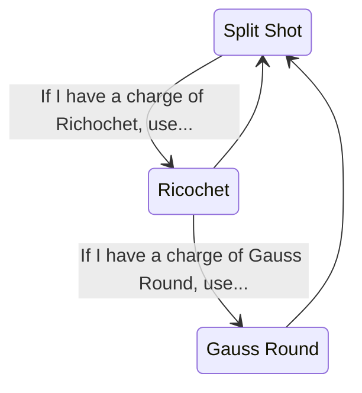
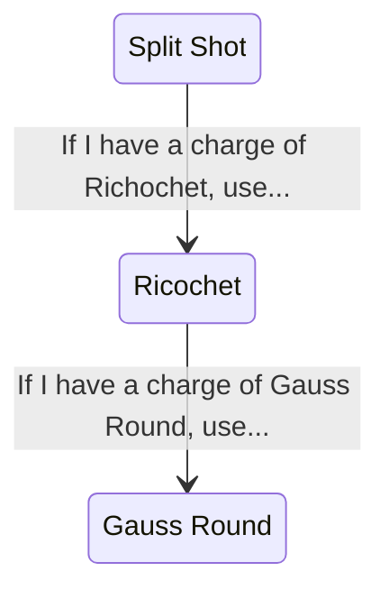

# A Lecture on How RSR Does What It Does, Demystification
## Rotation Solver Reborn (RSR) in Brief, Purpose

Hopefully you know that Rotation Solver Reborn (RSR) is a Dalamud plugin for FFXIV that assists users in performing rotations. By default, the plugin makes a best effort attempt to provide an optimal action choice for the user, but also provides the ability to be shown the action instead of performing it itself. How RSR makes this determination is the core purpose of this document. This may assist you in understanding why RSR does what it does. I will only be using pseudocode examples throughout this document, and trivializing some portions of the program for the sake of brevity and neccessity. Any asterisks you see are indications of such leaps.

## RSR is Not Smart

If you do not have a strong understanding of programming - or, if you are lost in the current AI wave - then you might be under the impression that RSR is somehow making strategic decisions (considering all known and *quid sit* quantites to come to a determination that will benefit the user) when in reality it is making prescriptive choices. It does not decide anything. Let's get into the anatomy of that which is the primary concern of the average reader: the rotation.

During this section I will be building out a diagram of RSR's "brain" using the Default Machinist Rotation as my running example.

## The Anatomy of a Rotation
It is first worth getting out into the open that, in the simplest of terms, RSR does what it does because a human told it too. It does these things based off the following:

### The GCD / Ability Loop
As a FFXIV player you should understand that there are two kinds of actions: spells/weaponskills (GCDs) and abilities (oGCDs). It should be further understood that putting oGCDs inbetween GCDs is called "Weaving." You generally do not want to use more than 2 oGCDs per GCD. Let's piece together the first layer of our RSR brain diagram.



RSR harshly maintains this cadence through priority of choice, but we'll cover that later. It does not want you "Triple weaving" and god forbid you truly succeed (enjoy your flag.)

Let me now include some pretty word-y "conditional phrases." I will also include the assumed "not currently in combat" or "nothing to do" state indicators, but will omit them after this diagram.



Let's populate this with some example Machinist actions, including some conditional phrasing.



This example would be a completely valid rotation. Not a good one, but a completely valid one. We have told, in code, RSR to use Split Shot and while it is cooling down use two iconic Machinist oGCDs. You check each conditional statement in order, from top to bottom, returning to the top whenever you use an action of any kind. Let's assume that return to the top going forward, and the oGCD / GCD ratio "restriction", so our diagram now looks like this.



### The Priority of Choice
Let's get straight into some pseudocode for this part.

```
EmergencyAbility{

}

GeneralGCD{

}

AttackAbility{

}
```
I've laid out the above pseudocode in the way that RSR manages things behind the scenes (what we in the business call the DataCenter), though how any rotation is laid out doesn't actually matter function to function. GeneralGCD could be at the end, etc., RSR doesn't care.

The three sections I've displayed here (there are many more) are:

1. Emergency Ability: These always fire off, with utmost priority, if they can be used.
2. GeneralGCD: If you can use a GCD, you will use something from here.
3. AttackAbility: If your GCD is cooling down, you will use one of these attack oGCDs.

Here is what our diagram looks like in the new pseudocode, I'll also include Machinist's Reassemble and dress up the code a little:

```
MCH_Default : MachinistRotation {
    EmergencyAbility{
        if can use Reassemble: use Reassemble
    }

    GeneralGCD{
        if can use SplitShot: use SplitShot
    }

    AttackAbility{
        if can use Ricochet: use Ricochet
        if can use GaussRound: use GaussRound
    }
}
```

Again, quite simple. A human could read down this list and follow these orders. If you can press Reassemble, press it. If you can't, press SplitShit. If you can't press SplitShot (say, because it's cool down), press Ricochet. If you can't press Ricochet, press GaussRound. If at any time you succeed at pressing one of the buttons, return to the top.

That means our Machinist, as written, would use Reassmble twice (wasting one charge) then use SplitShot. Skip Reassemble (no charges), skip SplitShot(GCD is cooling down), and use Ricochet. Right back down the list, and use Ricochet again. Then SplitShot, then Ricochet, then GaussRound because it skipped over the still cooling down Reassemble, SplitShot, and out of charges Ricochet.

Not a great rotation. However, one of the final missing pieces is the intricate web of logic that goes into a much more ffective rotation. Everything before this point should be enough to demystify how RSR works from an end user rotational point of view. There is no magic, there is no AI at work. It is simply a recipe of can I do it, and if not, what can I do next instead?

### Logic and Conditionals
What gives the facade of a higher order of intelligence over a simple recipe is the amount of work the rotation author does or does not put into the rotation. A rotation that will clear normal, simple content could be quite normal and simple. A rotation that performs at a level useful in EX+ is much more complex. Consider the following:

```
MCH_Default : MachinistRotation {
    EmergencyAbility{
        if can use Reassemble AND:
            1. You don't have Reassemble buff currently active.
            2. Reassemble has more than 0 charges.
            3. The next GCD you could use is either ChainSaw or Excavator
            OR
            1. You don't have the level for ChainSaw, but you'd hit a lot of targets with your shotgun.
            OR
            1. The next action isn't AirAnchor
            OR
            1. You're not high enough level for ChainSaw
            2. Your next GCD would be Drill
            OR
            1. You're not high enough level for Drill.
            2. Your next GCD would be CleanShot
            OR
            1. You're not high enough level for CleanShot
            2. Your next GCD isn't HotShot
        : use Reassemble
    }

    GeneralGCD{
        if can use AutoCrossbow: use AutoCrossbow
        if can use HeatBlast: use HeatBlast
        if can use Bioblaster: use Bioblaster
        
        if can use SpreadShot: use SpreadShot
        
        if can use CleanShot: use CleanShot
        if can use SlugShot: use SlugShot
        if can use SplitShot: use SplitShot
    }

    AttackAbility{
        if the player has the WildFire buff: use Hypercharge
        if can use Ricochet and GaussRound has been cooling down for less time than Ricochet: use Ricochet
        if can use GaussRound: use GaussRound
    }
}
```

You can see from the brief expasnion of pseudocode above that there is a mixture of limited, simple, and multifaceted logic. This example here being a greatly parred down MCH rotation from what is live. Such rotations and logic are built iteratively and based off the experience or research of the author. This also doesn't include the settings that live within the rotation file either.

### A note on the Interface versus the Mechanism
When it comes to writing rotations the author will generally be interacting with something that can be referred to as an Interface. Not to be confused with a UI; an Interface in programming is a layer intended to be used by another programmer for purposes of extending the capabilities of that program. The rotations that you can find in #3rd-party-rotations in the Discord are examples of authors producing rotation files that use this Interface. It standardizes what the author can write and interact with. It also remvoes the need for the author to build the entire plugin from source.

What is my point here? You see in the pseudocode above where it says `MCH_Default : MachinistRotation`? This is telling us that MCH_Default is our rotation - our interaction with the Interface - and it is sitting over the MachinistRotation "Mechanism." Which the moment you cross that colon into the Mechanism you get into the guts of the RSR machine. Things like the targetting system, the conditional system, all the little lights and switches you can flick throughout RSR. This is the beast that is contended with when a question outside of things like "why does the dragoon dot wear off?" go.

## Final Thoughts
If you made it this far I want to thank you for taking the time to read, or at least skim through the content I've written here. As always this document is only as good as it is young, so there will be drift in time. Further, espcially there at the end, I hope it inspires you to consider writing rotation content for RSR. While it may seem pretty big at first I gaurantee you rotation writing is only as complex as you make it, and potentially a good way to get into coding if you haven't before. I might even produce a series on how to get started some day. Or I might not, that's the beauty of RSR.

Take care and remember someone has to press all these buttons,

Crito and the RSR Team